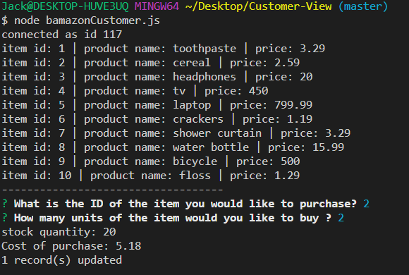

# Customer-View

This app checks the linked database and shows you the products, their price, and their item id. You are then prompted to select which item you would like to purchase base on that item's id. Then you are promtped for how many of that item you would like to purchase, and if there are enough items in stock it will return the total cost of the transaction. Otherwise, insufficient quantity! will be returned.

To run the app npm install mysql, and inquirer to get the required packages.
I(Jack Lawless) was the sole developer for this project

Deployed link https://soblique.github.io/Customer-View
